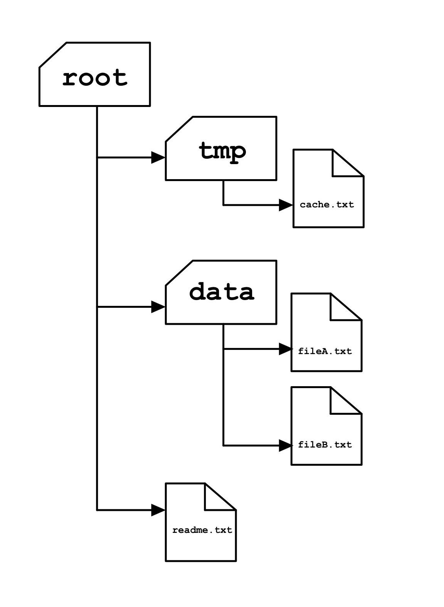

# File Searcher

This project can be found in [Educative.io](https://www.educative.io/)'s [JavaScript in Detail: From Beginner to Advanced](https://www.educative.io/courses/javascript-in-detail-from-beginner-to-advanced) course.


## Problem Description
Search files for string tokens in JavaScript.


## Topics Covered
- [Background](#background)
- [Task](#task)
  - [Sub-tasks](#sub-tasks)
    1. [Get path names](#1-get-path-names)
    2. [Get nested path names](#2-get-nested-path-names)
    3. [Read files](#3-read-files)
    4. [Final step to search](#4-final-step-to-search)


## Background
Your local supermarket _**“Please Buy?”**_ has gone entirely digital. They maintain logs, receipts, and everything else on a computer. Despite the IT guy’s best effort, the files and folders are getting messy and things get lost. Given this problem, the IT guy wrote a program that gets directories of files and the line number within those files for a certain string token. The IT guy implemented a functional but slow, synchronous solution. To boost your ego, you decide to re-write the program in **JavaScript** to make it faster via **asynchronous programming**.


## Task
Use your **JavaScript** knowledge to implement the solution. When given the path to a directory and target **string** token, it should return an **object** with **keys** as _pathname_ and **values** as an **array** of _line numbers_ in which the **string** token _matches_. The solution will leverage **asynchronous programming**.



Keeping the complexity of directories in mind, solve this with the following **sub-tasks**.


### Sub-tasks
The **sub-tasks** of the project are here.


#### 1. Get path names
First, get the names of _all_ files and folders in a directory. Because we are doing the project **asynchronously**, this involves returning a **promise** that lists all files and folders in the current directory.

```javascript
'root'
=>
['root/tmp', 'root/data', 'root/readme.txt']
```

From the example, we can see that it will list all files and folders in the given directory, where all directories prepended the given directory pathname to create paths to them. This gives us **single level** directory information.


#### 2. Get nested path names
Now, find _all the possible paths to files and folders_ for a given directory. This part involves going into _sub-folders_ **recursively** until all are traversed. In the end, it returns all possible path names to folders and files for a given directory in an **array**.

```javascript
'root'
=>
['root/tmp', 'root/data', 'root/readme.txt', 'root/tmp/cache.txt', 'root/data/data', 'root/data/data/fileB.txt']
```

The example showcases exhaustive possible directories in the form of an **array**, enabling us to index any directory or file within the given directory. Now, we have a better understanding of the given directory.


#### 3. Read files
With all _sub-directories_ and file locations, move onto reading all text files. Take a pathname to a directory and read the files in it to return an **array** of **sub-arrays** each containing the pathname of the file and its data.

```javascript
'root'
=>
[
  ['root/readme.txt',`${dataOf readme.txt}`],
  ['root/tmp/cache.txt',`${dataOf cache.txt}`],
  ['root/data/data/fileB.txt',`${dataOf fileB.txt}`]
]
```

Here, with this part, we have file paths and the corresponding data contained in them, all contained in a single **array** to finally process them for our search.


#### 4. Final step to search
Finally, use the preceding steps to look within data of files in a certain directory, list all that contain a certain **string** and at what _lines_. In this step, create an **object** with **keys** as the full path to file and **value** as an **array** containing line numbers, in which the target **string** resides.

```javascript
'root' 'someString'
=>
[
  {'root/readme.txt': [1, 5]},
  {'root/data/data/fileB.txt': [2, 3]}
]
```

Now, we have all occurrences of the target **string** which optimizes the search for files in any directory. The best aspect is the speed because it was done **asynchronously**.
